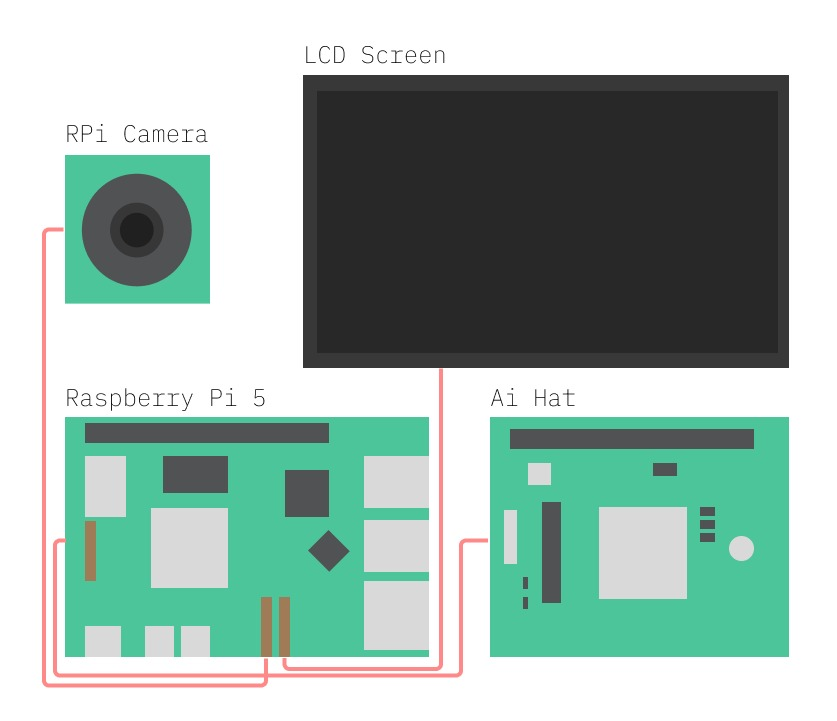
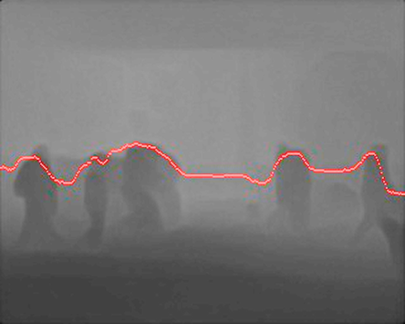

### **Vigil 17: Depth Sonification To Articulate A Synthetic “Umwelt”**

The repository catalogues the the software architecture and implementation of *Vigil 17* - a public depth sonification project situated at Blackfriar's bridge (London, UK). Using a Monocular Depth Estimation (MDE) algorithm, we present a framework for translating spatial distance to procedural audio systems from a single camera input. Through gradient-based analysis of the depth signal and mapping to wavetable buffers, a novel contour function is posited. Here, depth is explored as a substrate for real-time composition, rather than a static map.

These approaches are embedded within Vigil 17, a site-specific installation tracking environment depth as input, modulating an emergent soundscape generated with [SuperCollider](https://supercollider.github.io/). Through an embedded solution, we gesture towards [Sensory Substitution of Vision by Audition (SSVA)](https://link.springer.com/chapter/10.1007/978-94-017-1400-6_15), performing on-device real-time depth extraction and audio generation with modern Monocular Depth Estimation (MDE) approaches. 

### Monocular Depth Estimation

### System Architecture

<p align="center">
  
</p>

### Depth Signal Processing

To translate the depth signal into meaningful wavetable changes (sonically), a contour function $f$ is posited, tracing local gradient maxima across the depth map using gradient analysis. A pre/post-processing pipeline are implemented, stabilising the output signal and extracting salient variation in the wavetable mapping. The implementation can be found in [depth_stream.py](back-end/depth_stream.py) - this will be quoted here.     

The SC-Depth V3 [1] MDE algorithm is used to extract a depth matrix $D_{t} \in \mathbb{R}^{m \times n}$, at time $t$, from the site environment. Foreground extraction is applied, isolating the subjects (moving signal modulators) from the background (ground, sky, bridge). This is implemented using the [OpenCV](https://docs.opencv.org/4.x/d1/dfb/intro.html) `accumulateWeighted` method.

```python
cv2.accumulateWeighted(depth_norm, background, alpha)
```

A depth gradient map is extracted using [Sobel operators](https://docs.opencv.org/4.x/d2/d2c/tutorial_sobel_derivatives.html), implemented again with OpenCV with a kernel size of 3.

```python
sobel_x = cv2.Sobel(fg, cv2.CV_32F, 1, 0, ksize=3)
sobel_y = cv2.Sobel(fg, cv2.CV_32F, 0, 1, ksize=3)
```

Followed by [Gaussian smoothing](https://docs.opencv.org/4.x/d4/d13/tutorial_py_filtering.html), stablising our gradient depth matrix.

```python
grad_mag = cv2.GaussianBlur(cv2.convertScaleAbs(grad_mag), (5,5), 0)
```

Here, we have extracted a smoothed depth gradient matrix $G_{t} \in \mathbb{R}^{m \times n}$, defined over time $t$. Here, a *contour* function $f_{t}(x)$ that follows local gradient maxima can be posited
The trace falls into the \textit{steepest} ridges in depth space, moving horizontally. 

A column-wise maximum operator $g_{t}$ is defined s.t.

$$g_{t}(x) = \max_{{y = 1,...,m}} G_{t}(x, y)$$

```python
column = grad_mag[:, x]
# Applying max operator column-wise
max_grad = column.max()
```

Following this, $f_{t}$ can be defined as

$$        
f_t(x) =
        \begin{cases}
            g_{t}(x), & \text{if } g_t(x) \ge \tau, \\
            f_t(x-1), & \text{otherwise}.
        \end{cases}
$$

Implemented in the script as follows, where `y_positions` tracks values of $f_t(x)$ for discrete values of $x$.

```python
if max_grad >= tau:
    y = np.argmax(column)
    prev_y = y
else:
    y_positions.append(prev_y)
```

Here, $\tau$ is a gradient threshold, which is calibrated per-site. Thresholding isolates salient changes in the depth map. Here, both inter-frame (temporal) and inter-column (spatial) smoothing are applied. A still frame of the depth matrix, overlayed with the contour signal, is shown below.

<p align="center">
  
</p>

--- 

### References

[1] L. Sun, J.-W. Bian, H. Zhan, W. Yin, I. Reid, and C. Shen, “Sc-depthv3: Robust self-supervised monocular depth estimation for dynamic scenes,” IEEE Trans. Pattern Anal. Mach. Intell., vol. 46, no. 1, p. 497–508, Jan. 2024. [Online]. Available: https://doi.org/10.1109/TPAMI.2023.3322549
