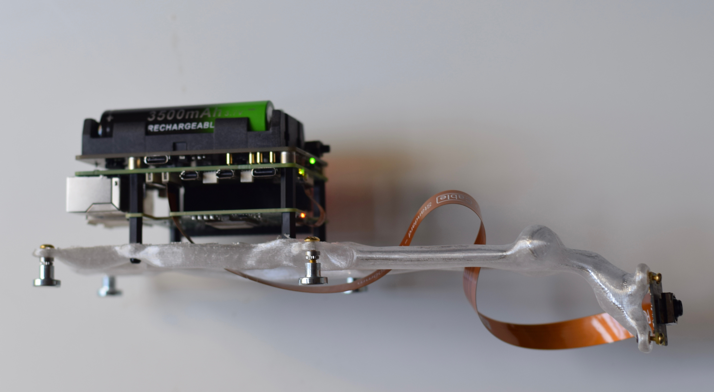

### **Vigil 17: Depth Sonification To Articulate A Synthetic “Umwelt”**

The repository catalogues the the software architecture and implementation of *Vigil 17* - a public depth sonification project situated at Blackfriar's bridge (London, UK). Using a Monocular Depth Estimation (MDE) algorithm, we present a framework for translating spatial distance to procedural audio systems from a single camera input. Through gradient-based analysis of the depth signal and mapping to wavetable buffers, a novel contour function is posited. Here, depth is explored as a substrate for real-time composition, rather than a static map.

<p align="center">
  
</p>

These approaches are embedded within Vigil 17, a site-specific installation tracking environment depth as input, modulating an emergent soundscape generated with [SuperCollider](https://supercollider.github.io/). Through an embedded solution, we gesture towards [Sensory Substitution of Vision by Audition (SSVA)](https://link.springer.com/chapter/10.1007/978-94-017-1400-6_15), performing on-device real-time depth extraction and audio generation with modern MDE approaches. 

### Technologies

Python backend computes the SC-DepthV3 [19] MDE algorithm, implementing pre- and post-procesing and extracting the contour function signal. The output is streamed as a real-time wavetable signal to SC via OSC, where it is inscribed to a buffer. The raw depth matrix is streamed to a Next.js front end via [WebSocket](https://developer.mozilla.org/en-US/docs/Web/API/WebSockets_API), where each frame is rendered to an HTML5 canvas element as a full-screen, greyscale image, providing a real-time visualisation of the depth signal. 

The SC audio output is simultaneously captured from the device audio interface and streamed to the same front end as a continuous binary audio stream over a second WebSocket connection. The browser reconstructs and plays back the audio in real time using the Web Audio API, allowing the sonification and its corresponding depth visualisation to be experienced together in the browser. The application is deployed to Fly.io, ensuring a persistent, publicly accessible connection between the on-device Python producer and the browser client.

### Monocular Depth Estimation (MDE)

Traditionally, geometric principles and specialised sensors were used for explicit depth computation. With the rise of ML technologies, MDE [1] infers scene geometry directly from an RGB image. This is leveraged here, producing a depth map from a single camera input on-device. 

Vigil 17 uses the SC-Depth V3 [2] MDE algorithm to extract a depth matrix `depth_mat`. This is adapted from the `basic_pipelines/depth.py` example in the Hailo Raspberry 5 [examples repository](https://github.com/hailo-ai/hailo-rpi5-examples/tree/main), with the following extraction block processing a video buffer in real-time.

```python
roi = hailo.get_roi_from_buffer(buffer)
depth_mat = roi.get_objects_typed(hailo.HAILO_DEPTH_MASK)
depth_mat = depth_mat[0]
depth_mat = depth_mat.get_data()
depth_mat = np.array(depth_mat).reshape((256, 320)) 
```

### Depth Signal Processing

To translate the depth signal into meaningful wavetable changes (sonically), a contour function $f$ is posited, tracing local gradient maxima across the depth map using gradient analysis. A pre/post-processing pipeline are implemented, stabilising the output signal and extracting salient variation in the wavetable mapping. The implementation can be found in [depth_stream.py](back-end/depth_stream.py), this script will be quoted here.   

THIS IS ADAPTED FROM...

The SC-Depth V3 [2] MDE algorithm is used to extract a depth matrix $D_{t} \in \mathbb{R}^{m \times n}$, at time $t$, from the site environment. Foreground extraction is applied, isolating the subjects (moving signal modulators) from the background (ground, sky, bridge). This is implemented using the [OpenCV](https://docs.opencv.org/4.x/d1/dfb/intro.html) `accumulateWeighted` method.

```python
cv2.accumulateWeighted(depth_norm, background, alpha)
```

A depth gradient map is extracted using [Sobel operators](https://docs.opencv.org/4.x/d2/d2c/tutorial_sobel_derivatives.html), implemented again with OpenCV with a kernel size of 3.

```python
sobel_x = cv2.Sobel(fg, cv2.CV_32F, 1, 0, ksize=3)
sobel_y = cv2.Sobel(fg, cv2.CV_32F, 0, 1, ksize=3)
```

Followed by [Gaussian smoothing](https://docs.opencv.org/4.x/d4/d13/tutorial_py_filtering.html), stablising our gradient depth matrix.

```python
grad_mag = cv2.GaussianBlur(cv2.convertScaleAbs(grad_mag), (5,5), 0)
```

Here, we have extracted a smoothed depth gradient matrix $G_{t} \in \mathbb{R}^{m \times n}$, defined over time $t$. Here, a *contour* function $f_{t}(x)$ that follows local gradient maxima can be posited.
The trace falls into the \textit{steepest} ridges in depth space, moving horizontally. 

A column-wise maximum operator $g_{t}$ is defined s.t.

$$g_{t}(x) = \max_{{y = 1,...,m}} G_{t}(x, y)$$

```python
column = grad_mag[:, x]
# Applying max operator column-wise
max_grad = column.max()
```

Following this, $f_{t}$ can be defined as

$$        
f_t(x) =
        \begin{cases}
            g_{t}(x), & \text{if } g_t(x) \ge \tau, \\
            f_t(x-1), & \text{otherwise}.
        \end{cases}
$$

Implemented in the script as follows, where `y_positions` tracks values of $f_t(x)$ for discrete values of $x$.

```python
if max_grad >= tau:
    y = np.argmax(column)
    prev_y = y
else:
    y_positions.append(prev_y)
```

Here, $\tau$ is a gradient threshold, which is calibrated per-site. Thresholding isolates salient changes in the depth map. Here, inter-column (spatial) smoothing is applied using a 1D low-pass filter with coefficient `temporal_beta`.

```python
temporal_line = ((1 - temporal_beta) * prev_frame_line + temporal_beta * y_smooth).astype(np.int32)
```

Followed by inter-frame (temporal) smoothing using a `smooth_line` function implementing a Gaussian kernel.

```python
def smooth_line(y_positions, kernel_size=15):
    """1D Gaussian smoothing of y positions"""
    y_positions = np.array(y_positions, dtype=np.float32)
    kernel = cv2.getGaussianKernel(kernel_size, -1)
    smoothed = cv2.filter2D(y_positions, -1, kernel[:, 0])
    return smoothed.astype(np.int32)

y_smooth = smooth_line(y_positions, kernel_size=15)
```

A still frame of the depth matrix, overlayed with the contour signal, is shown below.

<p align="center">
  
</p>

### Sonification System

Signal is sent via OSC from the Python depth processing module to SuperCollider (SC) for audio synthesis. Here, the contour function is mapped to wavetable buffers, modulating timbral variation. In addition, a sample release module is included, triggered by sharp peaks in the depth map. This is implemented in the `depth_sonification.scd` patch, which will be quoted here. 

Before synthesis, we allocate a ring of 32 consecutively-addressed buffers — a requirement of `VOsc`.

```
~numBufs = 32;
~bufSize = 16384;
b = Buffer.allocConsecutive(~numBufs, s, ~bufSize);
b.do(_.zero);
```

Incoming arrays from Python are received via OSC. Each array is shaped into a waveform using `Env` interpolation, normalised, and converted to SC's internal wavetable format (which interleaves value and slope data for the server's oscillator UGens). The result is written into the ring at the next safe slot.

```
OSCdef(\recvWT, { |msg|
    var levels, wt, candidate;
    levels = [0] ++ msg[1..] ++ [0];
    levels = levels.normalize(-1, 1);
    wt = Env.new(levels, ...).asSignal(8192).normalize.asWavetable;

    candidate = (~writeIdx + 1) % ~numBufs;
    while { (candidate - ~readPos).abs % ~numBufs < ~safetyMargin } {
        candidate = (candidate + 1) % ~numBufs;
    };
    ~writeIdx = candidate;
    b[~writeIdx].loadCollection(wt);
}, '/wavetable');
```

`VOsc` reads continuously from the buffer ring while new wavetables are being written at the language layer. To prevent a buffer from being overwritten mid-read, SC reports the oscillator's mean read position back at 20 Hz via `SendReply`, and incoming wavetables are only committed to slots outside a safety margin of ±4 buffer positions from the current read head.

```
SendReply.kr(Impulse.kr(20), '/vosc_pos', bufmod.mean);
OSCdef(\readPos, { |msg| ~readPos = msg[3]; }, '/vosc_pos');
```

Eight detuned `VOsc` instances read from the buffer ring at positions modulated by independent low-frequency noise generators. `VOsc` performs continuous band-limited interpolation between adjacent buffers, so as the noise slowly shifts each oscillator's read position through the ring, it transitions smoothly between successive wavetable shapes — producing a slowly fluttering spectral texture. The eight voices are spread across the stereo field via `Splay`.

```
bufmod = LFNoise1.kr(1/8 ! 8).range(0, ~numBufs - 1.001);

sig = VOsc.ar(
    b[0].bufnum + bufmod,
    200 * { ExpRand(0.99, 1.01) }.dup(8),
    { Rand(0, 2pi) }.dup(8)
);
sig = Splay.ar(sig);
```

The signal is shaped through four chained `BPeakEQ` filters at C3–C6 (130 Hz $\rightarrow$ 1046 Hz), with gain tapering 3 dB per octave upward. This lifts the harmonic partials in the vocal/melodic register, giving the texture a melodic character. `FreeVerb2` then extends the spectral decay, establishing a sustained ambient bed.

```
sig = BPeakEQ.ar(sig,  130.81, 0.05, 12);  // C3
sig = BPeakEQ.ar(sig,  261.63, 0.05,  9);  // C4
sig = BPeakEQ.ar(sig,  523.25, 0.05,  6);  // C5
sig = BPeakEQ.ar(sig, 1046.50, 0.05,  3);  // C6

sig = FreeVerb2.ar(sig[0], sig[1], mix: 0.35, room: 0.8, damp: 0.4);
```

A separate OSC listener handles triggered playback of pre-loaded audio samples. The lateral position of a detected signal (derived from the depth frame's gradient-maxima column, 0–1 left→right) is mapped to a stereo pan position. Each trigger selects a random buffer from the loaded sample pool and spawns a `\stationSample` synth.

```
OSCdef(\sampleTrigger, { |msg|
    var pan = msg[1].linlin(0.0, 1.0, -1.0, 1.0);
    var buf = ~sampleBufs.choose;
    Synth(\stationSample, [\buf, buf.bufnum, \pan, pan]);
}, '/sample_trigger');
```

### System Architecture
The system is embedded on a [Raspberry Pi 5](https://www.raspberrypi.com/products/raspberry-pi-5/), with a 2.4GHz quad-core 64-bit Arm Cortex-A76 CPU and 8 GB of RAM. The Raspberry Pi [Active Cooler](https://www.raspberrypi.com/products/active-cooler/) was installed, preventing thermal throttling. The 13 TOPS variant of the [HAILO AI HAT+ NPU](https://hailo.ai/products/ai-accelerators/hailo-8l-ai-accelerator-for-ai-light-applications) is attached, accelerating inference modules and opening up the possibility of a local implementation, handling the pipeline in real-time. The Raspberry Pi [Camera Module 3](https://www.raspberrypi.com/products/camera-module-3/) captures the environment image signal. 

<p align="center">
  
</p>

--- 

### TODO

- [✓] Add technologies section
- [✗] Is front end code updated?
- [✗] Sonification system breakdown
- [✗] Finalise `depth_stream.py`
- [✗] Modularise Python-side code base
- [✗] Update system architecture schematic
- [✗] Add audio streaming to back end

### References
[1] Eigen, C. Puhrsch, and R. Fergus, “Depth map pre- diction from a single image using a multi-scale deep network,” in Proceedings of the 28th International Conference on Neural Information Processing Systems - Volume 2, ser. NIPS’14. Cambridge, MA, USA: MIT Press, 2014, p. 2366–2374.

[1] L. Sun, J.-W. Bian, H. Zhan, W. Yin, I. Reid, and C. Shen, “Sc-depthv3: Robust self-supervised monocular depth estimation for dynamic scenes,” IEEE Trans. Pattern Anal. Mach. Intell., vol. 46, no. 1, p. 497–508, Jan. 2024. [Online]. Available: https://doi.org/10.1109/TPAMI.2023.3322549
